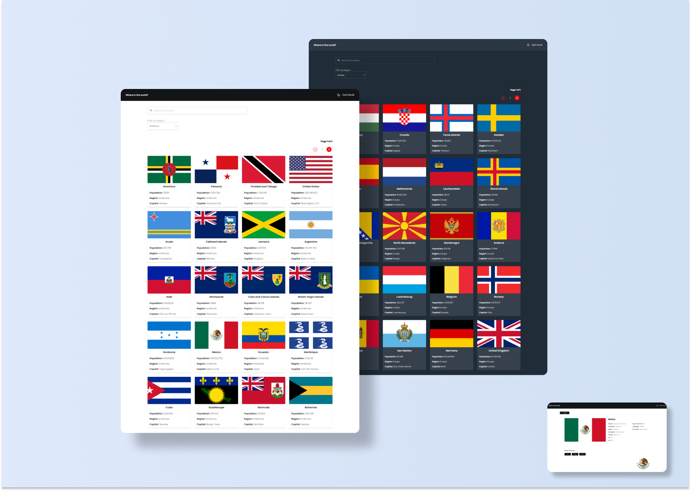

# CountriesApp &mdash; React 🌐



This application shows information of countries around the world. You can filter by their continent and even, you can look for a specific country by writing its name. It has multiple pages to navigate and it was developed following the "Mobile First" principle.

In addition, it has pagination to appreciate better each country when we scroll in the application and it has integrated a dark mode to change the ui which it is save at local storage to change it only when the user wants to do it. 

It's important to mention that this could be used to learn, since you find information about their capital, population, location, languages, etc.   

The API used to get the information of the countries is called REST Countries where you can find in:

```
https://restcountries.com/
```

## ***Techonologies, dependencies and services used***

  * ReactJs
  * JavaScript
  * HTML5
  * MaterialUI
  * React Router DOM
  * Hooks ( useState, useEffect, useLocation, useContext, useReducer )
  * Custom Hooks ( useForm, useNavigatePage )
  * Netlify
  * Local Storage
  * Fetch API

Node was used to carry out this project, so, you must have in your system this language. Specifically version **16.16.0** 

Once you check this previous specification, you must install development dependencies. To do this, just execute into your terminal:

```
npm install
```

To see the changes that you apply in the code, you must run the application. Type the command: 

```
npm run dev
```

since this application was made with **Vite**

## ***UI Considerations***

Colors used: 
  * Dark theme: #2B3743
  * Font dark-theme: #FFFFFF
  * Light theme: #FFFFFF
  * Font light-theme: #111517;